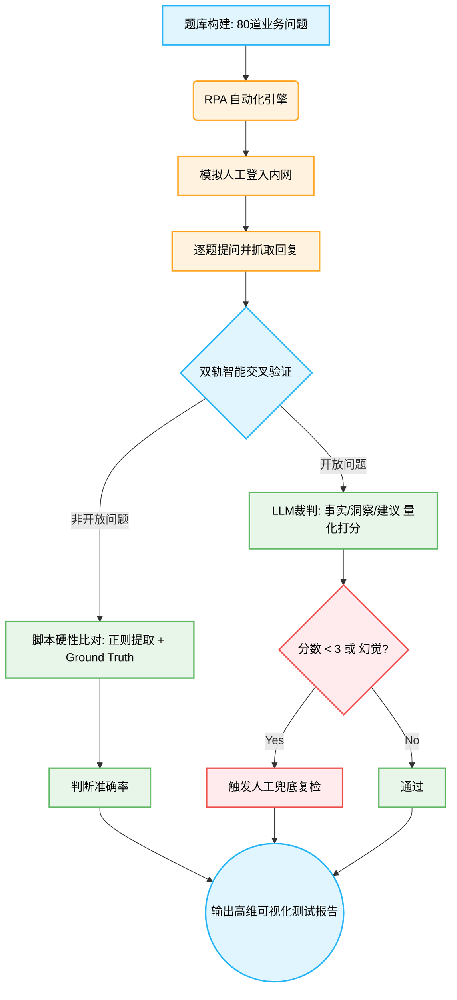

# 经分智能体效果测试方案 2.0（自动化对比+人工复检版）

## 一、 测试背景与目的

方案 2.0 转向**问题驱动测试**：模拟真实用户自然语言提问，通过对话接口验证回复效果。引入自动化评估机制，通过 RPA 和大模型裁判（LLM-as-a-Judge）对开放与非开放问题进行精准、高效的量化打分。

**测试目的**：
- 评估智能体对不同类型问题的回复准确性（事实准、逻辑严、建议可行、无幻觉）。
- 验证智能体从浅层事实查询到深度分析与管理建议的能力跃升。

## 二、 测试范围与核心策略

- **输入数据源**：构造高度拟真的高阶业务问题集（共 80 题），数据底座基于脱敏的真实系统报表（商机表、合同表、项目表等）。
- **执行方式**：通过 RPA（Robotic Process Automation）自动化脚本驱动 Edge 浏览器，在系统内网对话框中进行无人值守的批量问题注入与回答抓取，并将回复内容秒级落盘。
- **问题分类与校验维度**：

| 问题类型 | 题型定义与特性 | 数量分布 | 核心评判标准与验证逻辑 |
| :--- | :--- | :--- | :--- |
| **非开放问题 （硬逻辑校验）** | 客观事实查询、跨表统计、极值聚合。有绝对唯一的数值或明确的枚举列表答案。 | 50 题 | **事实级精准度 (Accuracy)**。 利用 Python 脚本正则匹配提取核心数值或特定实体，与 Ground Truth 进行 100% 强等值比对。 |
| **开放问题 （高维主观校验）** | 面向经营管理层的宏观主观分析、流失归因推演与高阶策略建议。 | 30 题 | **逻辑与建议可行性 (Insight & Action)**。 引入 LLM 裁判，依据“事实匹配、深度分析、建议有效性”三大维度进行结构化评分。 |

## 三、 自动化打分与判断方法

本方案摒弃纯人工审阅，全面拥抱自动化与智能化评估。

### 1. 非开放问题（硬性比对）
- **比对标准**：提前基于测试数据集计算所得的绝对真理（Ground Truth）。
- **执行方法**：自动化脚本提取智能体回复的核心数值或实体名单，与 Ground Truth 进行精准比对。
- **1-5 分量化打分标准**：

| 分值 | 打分标准 |
| :---: | :--- |
| **5 分** | 核心数值/名单完全匹配，无多余错误信息。 |
| **4 分** | 核心结论正确，但存在冗余的非关键错误信息或轻微单位格式瑕疵。 |
| **3 分** | 列表型问题命中大部分（如 Top3 对了 2 个），或数值误差在极小可接受范围内。 |
| **2 分** | 核心数据错误，但命中了部分相关实体，答非所问但大方向在相关领域。 |
| **1 分** | 完全错误或产生严重幻觉（凭空捏造数据/名单）。 |

### 2. 开放问题（LLM-as-a-Judge 智能裁判法）
鉴于大模型（智能体）的输出为非结构化自由文本，测试方案引入高阶大模型作为自动化裁判。

**核心评估理念**：
忽略智能体的回答的表面排版格式，纯粹穿透底层要义，考察其是否涵盖三大核心考点。LLM 裁判会对以下三个维度分别进行 **1-5 分的独立打分**，最终按权重核算总分：

| 评分维度 | 5 分 (优秀) | 4 分 (良好) | 3 分 (及格) | 2 分 (较差) | 1 分 (极差) |
| :--- | :--- | :--- | :--- | :--- | :--- |
| **事实与数据层 (40%权重)** | 精准提取所有关键业务数据和实体，无遗漏，与底层事实 100% 吻合。 | 提取大部分核心数据，次要数据轻微遗漏，不影响整体准确性。 | 存在部分关键数据缺失，或使用了模糊的定性描述而非精确数值。 | 关键数据提取错误或遗漏严重，事实基础薄弱。 | 完全没有引用数据，或出现严重的“数据幻觉”（凭空捏造）。 |
| **归纳与分析层 (30%权重)** | 洞察极其深刻，精准击中业务根因，逻辑推演严密且闭环。 | 分析逻辑合理，指出主要问题，但深度略显不足，偏向现象总结。 | 逻辑尚可，但分析较为模式化或套话，缺乏针对性解读。 | 归因错误，逻辑混乱，或结论与前文事实数据相矛盾。 | 毫无分析可言，仅重复数据，或完全答非所问。 |
| **落地与建议层 (30%权重)** | 建议极具实操性、针对性，能直接转化为管理动作（有明确抓手）。 | 建议具备一定可行性，方向正确，但在具体落地细节上略显宽泛。 | 建议属于行业“车轱辘话”（如“加强管理”），放之四海而皆准。 | 建议不切实际，或完全无法在当前业务场景下落地。 | 未给出任何建议，或给出的建议会对业务产生负面影响。 |

**自动化测试实施路径**：
1. **数据捕获**：通过 RPA 脚本批量拉取智能体对 30 道开放题的实际回答，落盘至 `result.xlsx` 的“智能体回复”列。
2. **裁判审阅**：评测脚本循环读取“用户提问 + 三段式标准答案 + 智能体实际回复”，将三者拼装进入裁判大模型的 Prompt 模板。
3. **量化定级**：由裁判大模型以专家视角输出分数（1-5分）与详细的扣分理由。
4. **人工兜底 (Human-in-the-loop)**：仅对裁判大模型给出异常低分（<3分）或涉嫌严重幻觉的极端 Case 触发人工介入复检。

### 3. 测试用例与评分展示（典型示例）

为了更直观地展示打分逻辑，以下提供了开放与非开放问题的标准范例与评分解析：

#### 【示例 A】非开放问题（客观事实与逻辑计算）
- **测试提问**：“当前总金额超千万且净利率低于 10% 的大额低利润合同共有多少个？”
- **Ground Truth（系统真理）**：`28`

| 回复质量 | 智能体回复示例 | 自动化评估逻辑 | 最终得分 |
| :---: | :--- | :--- | :---: |
| 🟢 **优秀** | “根据系统数据查询，当前金额超千万且净利率<10%的合同共有 **28** 个。” | **自动化脚本判定**：正则精准提取到核心数值 `28`，与 Ground Truth 完全等值匹配。 | **5 分** |
| 🔴 **不及格** | “当前此类大额低利合同共有 25 个，主要集中在软件智能业务线。” | **自动化脚本判定**：提取数值为 `25`，与事实严重不符，判定为计算错误或出现幻觉。 | **0 分** |

#### 【示例 B】开放问题（主观洞察与策略推演）
- **测试提问**：“为什么数智运营产品线的商机转化率偏低？请结合数据给出破局建议。”
- **标准评估基准（三段式 Target）**：
  1. **事实与数据**：赢单率约 51.37%，排除原因 Top2 为商务条款(25个)与延期(25个)。
  2. **洞察与分析**：转化偏低的核心流失原因为“项目周期拖延”与“商务价格底线未达成一致”。
  3. **落地建议**：建立里程碑追踪防延期，推出模块化/分级报价方案降低商务门槛。

| 评级 | 智能体回复示例 | 事实与数据层 (满分2分) | 归纳与分析层 (满分1.5分) | 落地与建议层 (满分1.5分) | 最终得分 |
| :---: | :--- | :--- | :--- | :--- | :---: |
| 🟢 **优秀** | “目前数智运营产品线赢单率徘徊在 51% 左右，主要痛点在于商务条款分歧以及项目审批延期导致大量商机流失。建议针对延期现象设立阶段停留红线并加强追踪；针对商务难点，方案团队应推出敏捷版/豪华版的梯次化报价策略，以提升最终转化。” | **得 2 分** 覆盖核心数据。 | **得 1.5 分** 精准指出延期与条款痛点。 | **得 1.5 分** 梯次报价与防延期追踪完全具备实操性。 | **5 分** |
| 🔴 **不及格** | “数智运营产品线商机转化率低主要是因为前端销售团队不够努力，产品缺乏吸引力。建议大家多跑一线跟客户沟通，了解客户真实想法，争取多签单。” | **得 0 分** 完全缺失真实数据支撑。 | **得 0.5 分** 归因流于表面，无视真实记录。 | **得 0.5 分** 建议宽泛空洞，属车轱辘话。 | **1 分** *(人工复检)* |

## 四、 核心度量指标体系 (Core Evaluation Metrics)

引入大模型评测领域前沿的**“3D 黄金度量矩阵”**，建立三大核心维度：

| 核心维度 | 评判逻辑 | 量化与验证方式 | 目标阈值 |
| :--- | :--- | :--- | :--- |
| **多维准确性 (Multidimensional Accuracy)** | **事实与逻辑双重校验。**确保数据检索不漏、业务计算不错、逻辑推演不偏。 | 非开放题采用“脚本精准比对匹配度”；开放题采用“LLM 裁判 1-5 分量化矩阵”。 | 非开放题准确率 100%； 开放题平均分 ≥ 4.5 分。 |
| **一致性与鲁棒性 (Consistency & Robustness)** | 面对相同的高阶经营提问或存在微小扰动的 Prompt 时，系统能否提供绝对稳定的解答输出。 | 在高并发压力测试下，对同一问题抽样 20 次并计算输出结果的零差异比率。<span style="color: red;">非开放题要求结果绝对一致；开放题要求核心观点与数据无冲突，允许措辞微调（语义一致性）。</span> | **100% 零差异率**。<span style="color: red;">（非开放题 100% 零差异；开放题语义一致性 ≥ 95%）</span> |
| **零幻觉溯源率 (Zero-Hallucination)** | 输出文本中引用的任意具体数值、阶段名称或最终用户实体，必须 100% 拥有底层测试数据集的引用依据凭证。严防模型脑补。 | **实体链接穿透率计算**：由 LLM 裁判提取数值/实体，交由交叉脚本与原始数据表做溯源比对。 | 绝对 **0 幻觉** （容忍度 0%）。 |

**综合通过标准**：准确性平均分 ≥ 4.5 分 + 一致性 100% + 零幻觉。

## 五、 自动化与智能化测试执行流程




1. **题库构建与基准锁定 (Test Case Engineering)**：基于真实的「商机表」、「合同表」与「项目表」底层核心数据，构建 80 道高拟真度经营分析问题。通过 Python 脚本计算并绝对锁定各题的 Ground Truth 及「三段式」评估基准，确保后续裁判标准的零误差与绝对客观。
2. **RPA 无人值守执行 (Robotic Process Automation)**：引入 Playwright 自动化引擎，挂载 RPA 脚本对智能体交互界面进行无人值守跑批提问。脚本将自动注入测试数据、监听动态流式输出、提取完整回答文本，并将结果秒级落盘至数据表（`result.xlsx`）。<span style="color: red;">（注：脚本需内置异常重试机制，如元素加载超时自动重试 3 次，并详细记录失败用例以便排查）</span>彻底消除人工手动复制粘贴带来的低效与疲劳。
3. **双轨智能交叉验证 (Dual-Track Validation)**：
   - **非开放题（硬性校验）**：通过正则提取与实体识别脚本，将智能体回复的数值、列表与 Ground Truth 进行毫秒级精准硬性比对。
   - **开放题（LLM-as-a-Judge）**：将智能体输出的非结构化长文本喂入高阶裁判大模型，严格按照「事实准确度、业务洞察力、建议可行性」三维评分矩阵进行语义解析与量化打分。仅对裁判给出异常分数的案例触发人工复检。
4. **缺陷洞察与高维报告产出 (Metrics & Insights Reporting)**：聚合准确性、一致性与无幻觉性三大核心指标，自动生成可视化评测矩阵。拒绝只交出冰冷的测试分数，着重提炼智能体在“意图理解偏差、底层数据检索遗漏、深层逻辑推理断层”等维度的典型 Bad Case，用以反向倒逼经分智能体底层 RAG 链路与知识检索架构的精准迭代。

## 六、 AI 辅助协作测试工程过程

本测试方案从零到一的构建过程，全程引入 **Cursor AI（Agent 模式）** 作为协作工具，实现了"人机结合"的测试工程范式。以下为各阶段的协作过程与经验沉淀，供后续类似项目参考复用。

### 1. 协作工具与模式

- **工具**：Cursor IDE + 内置 AI Agent（基于大模型的对话式编程助手）
- **协作模式**：测试工程师提需求与业务判断，AI 负责代码实现、方案草稿与文档整理
- **核心价值**：将原本需要数天的脚本开发与文档撰写压缩至数小时，并通过多轮对话迭代持续优化

### 2. 各阶段协作过程

#### 阶段一：测试题库设计（需求分析 → 题目构建）

- **所需外部协作**：
  - 开发：提供数据字典（各表字段名、字段含义、枚举值说明）
  - 产品：提供 PRD 或业务需求文档（核心业务场景、用户角色与典型查询意图）
  - 业务方：提供真实业务问题样例（"老板最常问什么"），校验题目业务合理性
- **协作内容**：向 AI 描述业务背景（商机表、合同表、项目表的字段结构与业务含义），由 AI 辅助生成覆盖"查数、聚合、排序、归因分析、策略建议"等多种题型的测试问题集。
- **参考 Prompt**：
  > 我正在测试一款面向销售管理的经营分析智能体。底层数据有三张表：商机表（含商机金额、销售流程/阶段、预计签单日期、赢单率等字段）、合同表（含合同金额、净利润、最终用户名等字段）、项目表。请基于这些数据维度，帮我设计 80 道测试问题，其中 50 道非开放题（含单表查询、聚合求和、排序 TOP N、多表关联）、30 道开放题（面向老板视角，如商机卡点分析、客户风险预警）。每道题需注明数据来源字段，非开放题需提供基准答案。
- **迭代过程**：初版生成后，测试工程师结合真实业务场景对题目进行筛选与修改，AI 同步调整题目措辞与难度分布，最终形成 **80 道高拟真度测试题**（非开放 50 题 + 开放 30 题）。
- **关键产出**：`test_data/测试数据.xlsx`（含问题、基准答案、三段式参考答案）

#### 阶段二：Ground Truth 计算（基准答案锁定）

- **所需外部协作**：
  - 开发：提供脱敏后的原始数据导出文件（CSV/Excel），并确认数据口径（如金额单位、日期格式）
  - 开发：如数据量大，提供数据库只读查询权限或视图，便于脚本直连验证
- **协作内容**：将原始数据表结构告知 AI，由 AI 编写 Python 脚本，基于真实脱敏数据自动计算每道非开放题的绝对正确答案（Ground Truth）。
- **参考 Prompt**：
  > 现在我有真实的脱敏数据文件（fact_opportunity.csv、fact_contract.csv），数据字段如下：[粘贴字段列表]。请帮我编写 Python 脚本，依次计算以下非开放题的基准答案：[粘贴题目列表]。要求：每道题单独一个函数，输出题号和计算结果，方便我逐题核对。
- **迭代过程**：AI 生成初版脚本后，测试工程师运行验证，对数值偏差的题目反馈给 AI 修正，最终确保 100% 基准答案与原始数据完全吻合。
- **关键产出**：`scripts/data/` 目录下的系列计算脚本

#### 阶段三：RPA 自动化脚本开发（核心执行引擎）

- **所需外部协作**：
  - 开发：提供测试环境访问地址（内网 URL）及登录账号，说明页面关键 DOM 结构或 API 接口
  - 运维/IT：提供内网 VPN 接入方式，确保自动化脚本所在机器可访问测试环境
- **协作内容**：向 AI 描述目标系统的页面结构（内网经分智能体对话框的 DOM 层级、流式输出特性、气泡定位方式），由 AI 使用 Playwright 编写自动化测试脚本。
- **参考 Prompt**：
  > 请用 Playwright（Python）帮我写一个自动化测试脚本。目标系统是内网的经分智能体对话页面，已用 Edge 浏览器登录。页面结构：输入框 CSS 选择器为 [xxx]，发送按钮为 [xxx]，回复气泡为 [xxx]（流式输出，需等待文字不再变化后再提取）。脚本需读取 test_data/测试数据.xlsx 的问题列，逐题输入问题并抓取完整回复，结果追加写入 result.xlsx 的"智能体回复"列。网络超时自动重试 3 次，失败用例标注"【抓取失败】"。
- **迭代过程**：经历多轮调试——从元素定位失败、流式输出截断到异常重试机制的完善，测试工程师负责在真实环境中执行并反馈报错信息，AI 负责快速定位问题并修复代码。
- **关键产出**：`scripts/rpa/run_edge_rpa.py`（支持批量无人值守问答与结果自动落盘）

#### 阶段四：测试结果处理（数据清洗与评估）

- **所需外部协作**：
  - 开发/算法：提供 LLM 裁判接口文档（API Key、调用格式、模型版本），或授权使用现有大模型服务
  - 业务方：对裁判评分存疑的典型 Bad Case 进行人工复核，给出最终业务判断
- **协作内容**：RPA 抓取完成后，由 AI 辅助编写数据清洗脚本，对抓取失败的用例进行标记，并构建自动化评分脚本（调用 LLM 裁判接口）。
- **参考 Prompt**：
  > 请阅读工作区里的 `与AI协作全过程.md` 和 `测试方案优化总结.md` 这两个文件，快速了解我们之前做过的所有工作和 RPA 测试策略。然后帮我处理 RPA 抓回来的测试结果数据：① 检查 result.xlsx，统计抓取失败用例并标注；② 编写自动化评分脚本，调用大模型 API，对开放题按"事实准确度、业务洞察力、建议可行性"三维打分（1-5分），输出分数和扣分理由；③ 非开放题用正则与 Ground Truth 对比，输出是否匹配。
- **关键产出**：`test_result/result.xlsx`（含智能体回复、评分结果）、`scripts/data/` 下的评分脚本

#### 阶段五：测试方案文档优化（本文档）

- **所需外部协作**：
  - 产品/项目经理：提供文档规范模板（章节结构要求、公司文档标准）
  - 评审人员（测试负责人、业务方）：对文档内容进行评审，提出修改意见
- **协作内容**：测试工程师提出文档规范要求（标题层级、加粗原则、表格格式），AI 对方案文档进行全面重排版，并根据评审反馈持续迭代优化。
- **参考 Prompt**：
  > 请帮我优化 `经分智能体测试方案2.0.md` 的排版格式。要求：① 标题层级规范，`#` 为全局主标题，`##` 为章节标题，`###` 为子章节；② 加粗克制精准，只对核心名词和关键指标加粗，大段描述文本不加粗；③ 表格对齐使用标准 Markdown 三线表；④ 全文结构清晰，逻辑层次分明。
- **关键产出**：`test_plan/经分智能体测试方案2.0.md`（即本文档）

### 3. 协作经验总结

| 经验 | 说明 |
| :--- | :--- |
| **业务上下文要给足** | AI 对业务字段含义、数据结构不了解时，生成质量会明显下降。每次新开对话需先同步背景。 |
| **反馈要具体** | 描述"第3题答案算错了"不如直接贴出原始数据和期望结果，AI 修复效率更高。 |
| **人负责判断，AI负责实现** | 题目是否合理、答案是否符合业务逻辑，需由测试工程师把关；代码实现与文档整理交给 AI。 |
| **迭代优于一次到位** | 不追求 AI 第一次就完美输出，多轮对话逐步逼近目标比反复修改 Prompt 更高效。 |
| **对话记录即知识资产** | 完整的人机协作对话记录（`与AI协作全过程.md`）本身就是可追溯、可复盘的工程文档。 |

<span style="color: red;">
## 七、 附录：LLM 裁判 Prompt 模板

```json
{
  "role_definition": {
    "role": "资深经营分析总监兼质量审核官",
    "mission": "评估经分智能体回答的准确性、深度与落地性。",
    "tone": "严格、客观、数据驱动"
  },
  "evaluation_criteria": {
    "fact_check (1-5)": "是否包含所有关键数值和实体？有无幻觉？(权重 40%)",
    "analysis_depth (1-5)": "是否挖掘了数据背后的根因？逻辑是否闭环？(权重 30%)",
    "actionable_advice (1-5)": "建议是否具体可行？是否具备实操抓手？(权重 30%)"
  },
  "input_data": {
    "user_question": "{question}",
    "standard_answer": "{standard_answer}",
    "agent_response": "{agent_response}"
  },
  "output_format": {
    "type": "json",
    "schema": {
      "scores": {
        "fact": 0,
        "analysis": 0,
        "advice": 0
      },
      "weighted_total_score": 0.0,
      "reasoning": "扣分理由简述...",
      "is_hallucination": false,
      "need_human_review": false
    }
  }
}
```
</span>
