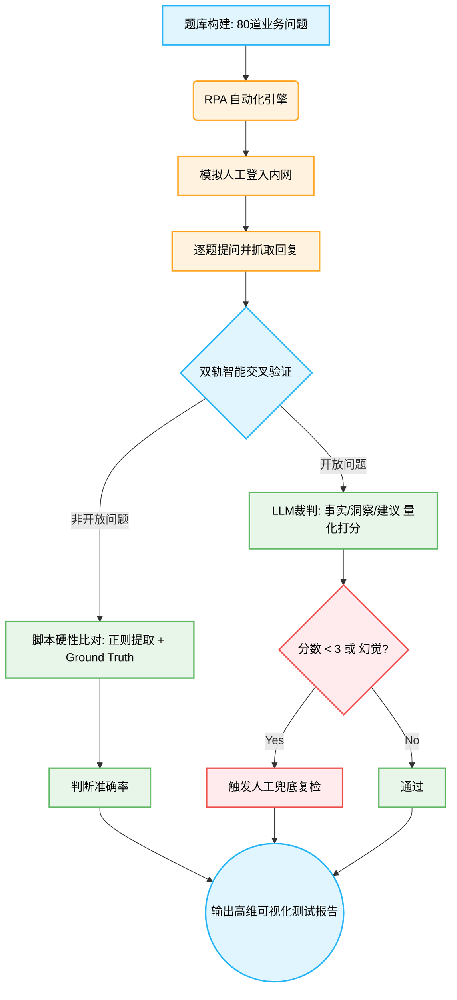

# 经分智能体效果测试方案 2.0（自动化对比+人工复检版）

## 一、 测试背景与目的

方案 2.0 转向**问题驱动测试**：模拟真实用户自然语言提问，通过对话接口验证回复效果。引入自动化评估机制，通过 RPA 和大模型裁判（LLM-as-a-Judge）对开放与非开放问题进行精准、高效的量化打分。

**测试目的**：
- 评估智能体对不同类型问题的回复准确性（事实准、逻辑严、建议可行、无幻觉）。
- 验证智能体从浅层事实查询到深度分析与管理建议的能力跃升。

## 二、 测试范围与核心策略

- **输入数据源**：构造高度拟真的高阶业务问题集（共 80 题），数据底座基于脱敏的真实系统报表（商机表、合同表、项目表等）。
- **执行方式**：通过 RPA（Robotic Process Automation）自动化脚本驱动 Edge 浏览器，在系统内网对话框中进行无人值守的批量问题注入与回答抓取，并将回复内容秒级落盘。
- **问题分类与校验维度**：

| 问题类型 | 题型定义与特性 | 数量分布 | 核心评判标准与验证逻辑 |
| :--- | :--- | :--- | :--- |
| **非开放问题 （硬逻辑校验）** | 客观事实查询、跨表统计、极值聚合。有绝对唯一的数值或明确的枚举列表答案。 | 50 题 | **事实级精准度 (Accuracy)**。 利用 Python 脚本正则匹配提取核心数值或特定实体，与 Ground Truth 进行 100% 强等值比对。 |
| **开放问题 （高维主观校验）** | 面向经营管理层的宏观主观分析、流失归因推演与高阶策略建议。 | 30 题 | **逻辑与建议可行性 (Insight & Action)**。 引入 LLM 裁判，依据“事实匹配、深度分析、建议有效性”三大维度进行结构化评分。 |

## 三、 自动化打分与判断方法

本方案摒弃纯人工审阅，全面拥抱自动化与智能化评估。

### 1. 非开放问题（硬性比对）
- **比对标准**：提前基于测试数据集计算所得的绝对真理（Ground Truth）。
- **执行方法**：自动化脚本提取智能体回复的核心数值或实体名单，与 Ground Truth 进行精准比对。
- **1-5 分量化打分标准**：

| 分值 | 打分标准 |
| :---: | :--- |
| **5 分** | 核心数值/名单完全匹配，无多余错误信息。 |
| **4 分** | 核心结论正确，但存在冗余的非关键错误信息或轻微单位格式瑕疵。 |
| **3 分** | 列表型问题命中大部分（如 Top3 对了 2 个），或数值误差在极小可接受范围内。 |
| **2 分** | 核心数据错误，但命中了部分相关实体，答非所问但大方向在相关领域。 |
| **1 分** | 完全错误或产生严重幻觉（凭空捏造数据/名单）。 |

### 2. 开放问题（LLM-as-a-Judge 智能裁判法）
鉴于大模型（智能体）的输出为非结构化自由文本，测试方案引入高阶大模型作为自动化裁判。

**核心评估理念**：
忽略排版格式，穿透底层语义，LLM 裁判会对以下三个维度分别进行 **1-5 分的独立打分**，最终按权重核算总分：

| 评分维度 | 5 分 (优秀) | 4 分 (良好) | 3 分 (及格) | 2 分 (较差) | 1 分 (极差) |
| :--- | :--- | :--- | :--- | :--- | :--- |
| **事实与数据层 (40%权重)** | 精准提取所有关键业务数据和实体，无遗漏，与底层事实 100% 吻合。 | 提取大部分核心数据，次要数据轻微遗漏，不影响整体准确性。 | 存在部分关键数据缺失，或使用了模糊的定性描述而非精确数值。 | 关键数据提取错误或遗漏严重，事实基础薄弱。 | 完全没有引用数据，或出现严重的“数据幻觉”（凭空捏造）。 |
| **归纳与分析层 (30%权重)** | 洞察极其深刻，精准击中业务根因，逻辑推演严密且闭环。 | 分析逻辑合理，指出主要问题，但深度略显不足，偏向现象总结。 | 逻辑尚可，但分析较为模式化或套话，缺乏针对性解读。 | 归因错误，逻辑混乱，或结论与前文事实数据相矛盾。 | 毫无分析可言，仅重复数据，或完全答非所问。 |
| **落地与建议层 (30%权重)** | 建议极具实操性、针对性，能直接转化为管理动作（有明确抓手）。 | 建议具备一定可行性，方向正确，但在具体落地细节上略显宽泛。 | 建议属于行业“车轱辘话”（如“加强管理”），放之四海而皆准。 | 建议不切实际，或完全无法在当前业务场景下落地。 | 未给出任何建议，或给出的建议会对业务产生负面影响。 |

**自动化测试实施路径**：
1. **数据捕获**：通过 RPA 脚本批量拉取智能体对 30 道开放题的实际回答，落盘至 `result.xlsx` 的“智能体回复”列。
2. **裁判审阅**：评测脚本循环读取“用户提问 + 三段式标准答案 + 智能体实际回复”，将三者拼装进入裁判大模型的 Prompt 模板。
3. **量化定级**：由裁判大模型以专家视角输出分数（1-5分）与详细的扣分理由。
4. **人工兜底 (Human-in-the-loop)**：仅对裁判大模型给出异常低分（<3分）或涉嫌严重幻觉的极端 Case 触发人工介入复检。

### 3. 测试用例与评分展示（典型示例）

为了更直观地展示打分逻辑，以下提供了开放与非开放问题的标准范例与评分解析：

#### 【示例 A】非开放问题（客观事实与逻辑计算）
- **测试提问**：“当前总金额超千万且净利率低于 10% 的大额低利润合同共有多少个？”
- **Ground Truth（系统真理）**：`28`

| 回复质量 | 智能体回复示例 | 自动化评估逻辑 | 最终得分 |
| :---: | :--- | :--- | :---: |
| 🟢 **优秀** | “根据系统数据查询，当前金额超千万且净利率<10%的合同共有 **28** 个。” | **自动化脚本判定**：正则精准提取到核心数值 `28`，与 Ground Truth 完全等值匹配。 | **5 分** |
| 🔴 **不及格** | “当前此类大额低利合同共有 25 个，主要集中在软件智能业务线。” | **自动化脚本判定**：提取数值为 `25`，与事实严重不符，判定为计算错误或出现幻觉。 | **0 分** |

#### 【示例 B】开放问题（主观洞察与策略推演）
- **测试提问**：“为什么数智运营产品线的商机转化率偏低？请结合数据给出破局建议。”
- **标准评估基准（三段式 Target）**：
  1. **事实与数据**：赢单率约 51.37%，排除原因 Top2 为商务条款(25个)与延期(25个)。
  2. **洞察与分析**：转化偏低的核心流失原因为“项目周期拖延”与“商务价格底线未达成一致”。
  3. **落地建议**：建立里程碑追踪防延期，推出模块化/分级报价方案降低商务门槛。

| 评级 | 智能体回复示例 | 事实与数据层 (满分2分) | 归纳与分析层 (满分1.5分) | 落地与建议层 (满分1.5分) | 最终得分 |
| :---: | :--- | :--- | :--- | :--- | :---: |
| 🟢 **优秀** | “目前数智运营产品线赢单率徘徊在 51% 左右，主要痛点在于商务条款分歧以及项目审批延期导致大量商机流失。建议针对延期现象设立阶段停留红线并加强追踪；针对商务难点，方案团队应推出敏捷版/豪华版的梯次化报价策略，以提升最终转化。” | **得 2 分** 覆盖核心数据。 | **得 1.5 分** 精准指出延期与条款痛点。 | **得 1.5 分** 梯次报价与防延期追踪完全具备实操性。 | **5 分** |
| 🔴 **不及格** | “数智运营产品线商机转化率低主要是因为前端销售团队不够努力，产品缺乏吸引力。建议大家多跑一线跟客户沟通，了解客户真实想法，争取多签单。” | **得 0 分** 完全缺失真实数据支撑。 | **得 0.5 分** 归因流于表面，无视真实记录。 | **得 0.5 分** 建议宽泛空洞，属车轱辘话。 | **1 分** *(人工复检)* |

## 四、 核心度量指标体系 (Core Evaluation Metrics)

引入大模型评测领域前沿的**“3D 黄金度量矩阵”**，建立三大核心维度：

| 核心维度 | 评判逻辑 | 量化与验证方式 | 目标阈值 |
| :--- | :--- | :--- | :--- |
| **多维准确性 (Multidimensional Accuracy)** | **事实与逻辑双重校验。**确保数据检索不漏、业务计算不错、逻辑推演不偏。 | 非开放题采用“脚本精准比对匹配度”；开放题采用“LLM 裁判 1-5 分量化矩阵”。 | 非开放题准确率 100%； 开放题平均分 ≥ 4.5 分。 |
| **一致性与鲁棒性 (Consistency & Robustness)** | 面对相同的高阶经营提问或存在微小扰动的 Prompt 时，系统能否提供绝对稳定的解答输出。 | 在高并发压力测试下，对同一问题抽样 20 次并计算输出结果的零差异比率。 | **100% 零差异率**。 |
| **零幻觉溯源率 (Zero-Hallucination)** | 输出文本中引用的任意具体数值、阶段名称或最终用户实体，必须 100% 拥有底层测试数据集的引用依据凭证。严防模型脑补。 | **实体链接穿透率计算**：由 LLM 裁判提取数值/实体，交由交叉脚本与原始数据表做溯源比对。 | 绝对 **0 幻觉** （容忍度 0%）。 |

**综合通过标准**：准确性平均分 ≥ 4.5 分 + 一致性 100% + 零幻觉。

## 五、 自动化与智能化测试执行流程

1. **题库构建与基准锁定 (Test Case Engineering)**：基于真实的「商机表」、「合同表」与「项目表」底层核心数据，构建 80 道高拟真度经营分析问题。通过 Python 脚本计算并绝对锁定各题的 Ground Truth 及「三段式」评估基准，确保后续裁判标准的零误差与绝对客观。
2. **RPA 无人值守执行 (Robotic Process Automation)**：引入 Playwright 自动化引擎，挂载 RPA 脚本对智能体交互界面进行无人值守跑批提问。脚本将自动注入测试数据、监听动态流式输出、提取完整回答文本，并将结果秒级落盘至数据表（`result.xlsx`），彻底消除人工手动复制粘贴带来的低效与疲劳。
3. **双轨智能交叉验证 (Dual-Track Validation)**：
   - **非开放题（硬性校验）**：通过正则提取与实体识别脚本，将智能体回复的数值、列表与 Ground Truth 进行毫秒级精准硬性比对。
   - **开放题（LLM-as-a-Judge）**：将智能体输出的非结构化长文本喂入高阶裁判大模型，严格按照「事实准确度、业务洞察力、建议可行性」三维评分矩阵进行语义解析与量化打分。仅对裁判给出异常分数的案例触发人工复检。
4. **缺陷洞察与高维报告产出 (Metrics & Insights Reporting)**：聚合准确性、一致性与无幻觉性三大核心指标，自动生成可视化评测矩阵。拒绝只交出冰冷的测试分数，着重提炼智能体在“意图理解偏差、底层数据检索遗漏、深层逻辑推理断层”等维度的典型 Bad Case，用以反向倒逼经分智能体底层 RAG 链路与知识检索架构的精准迭代。